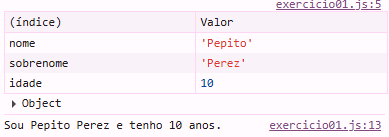

# Coleta de Dados Pessoais

Este é um código simples que solicita o nome, sobrenome e idade do usuário, e exibe essas informações no console. O código também agrupa os dados em uma tabela para facilitar a visualização.

## Funcionalidades

- Solicita ao usuário o nome, sobrenome e idade.
- Exibe uma mensagem formatada no console.
- Agrupa os dados em um objeto e os exibe como uma tabela no console.

## Como Usar

### Pré-requisitos:
- Navegador com suporte a JavaScript.
- Acesse o console do navegador para ver o resultado.

### Execução:
1. Abra o console de desenvolvedor do seu navegador.
2. Cole o código fornecido abaixo.

### Exemplo de Uso

```javascript
let nome = prompt("Digite seu nome:");
let sobrenome = prompt("Digite seu sobrenome:");
let idade = Number(prompt("Digite sua idade:"));

console.table({
  nome: nome,
  sobrenome: sobrenome,
  idade: idade,
});

console.log(`Sou ${nome} ${sobrenome} e tenho ${idade} anos.`);
```

## Tecnologias Usadas

- **JavaScript**: Para coletar e exibir as informações.

## Contribuindo

1. Faça um fork do repositório.
2. Crie uma branch para a sua feature (`git checkout -b feature/nome-da-feature`).
3. Faça suas mudanças e envie um pull request.

